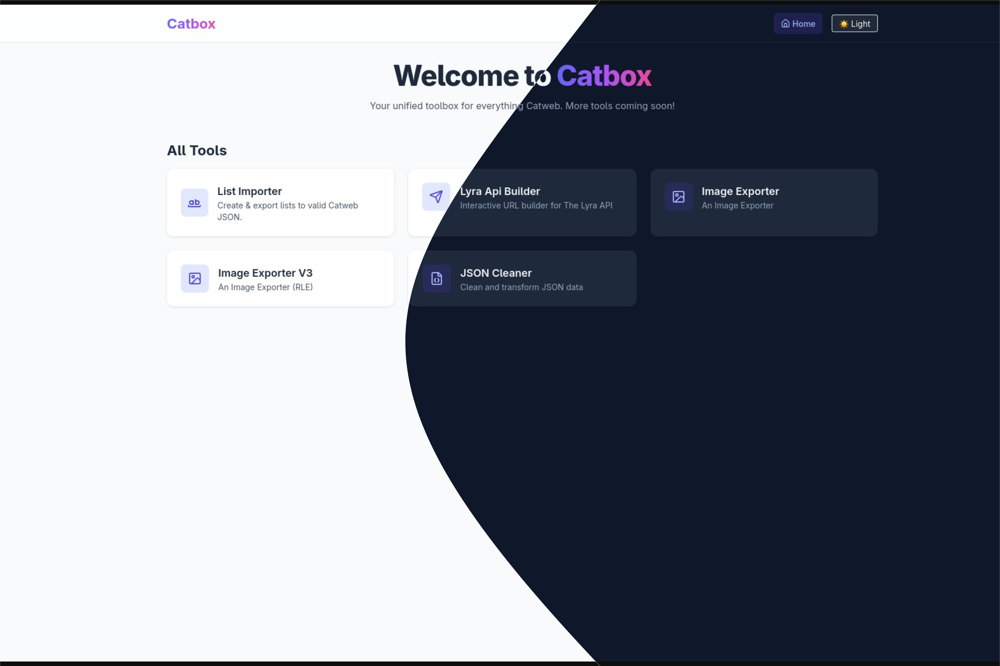

# Catbox


**Catbox – Your Catweb Toolbox Wherever You Go.**

[Live Demo](https://sxcatbox.vercel.app/)

---



## Overview
Catbox is an open-source web toolbox for Catweb users, hosted on Vercel. It provides multiple tools for managing JSON, images, scripts, and rich text for Roblox, as well as custom API interactions with Lyra. Users can use the site directly or self-host Catbox locally.

## Why Catbox
Catbox streamlines your Catweb workflow by combining multiple essential tools in one open-source, browser-accessible platform.

## Tools

- **List Importer V3** – Advanced JSON/Dictionary importer. Supports nested structs, recursive editing, and re-importing Catweb JSON with high precision.
- **Script Obfuscator** – Protect your CatWeb scripts with variable renaming, function chaining, and dummy code insertion.
- **Lyra API Builder** – Interactive API request builder for [Lyra](https://www.roblox.com/games/start?placeId=16855862021&launchData=lyra.rbx) playlists. Fill arguments, view return types, and generate requests for your Catweb projects.  
- **Image Exporter V3** – High-performance image-to-richtext converter with RLE and HEX compression. Supports splitting output across multiple textboxes to bypass Roblox limits.
- **Json Cleaner** – Optimized Catweb JSON transformer that embeds variable names into labels to bypass Roblox text filtering.
- **CatWeb Documentation** – Hosted specification files for CatWeb development. Download or copy `CatUI`, `CatDocs`, and `CatScript` specs.
- **Figma Exporter** – Convert Figma designs directly to CatWeb JSON. Supports both relative Scale and absolute Roblox (1920x1080) coordinate modes.
- **Script Editor** – (WIP) Full-featured web-based script editor with a block-based interface.
- **Rich Text Editor** – (WIP) WYSIWYG rich text editor that outputs Roblox-compatible XML rich text.

> **Note:** Image Exporter V2 exists but is deprecated and hidden from the homepage.

## Quick Start

### Use Online
Visit [Catbox Live](https://sxcatbox.vercel.app/) and use any of the available tools directly. No installation required.

### Self-Host
1. Clone the repository:  
    ```bash
   git clone https://github.com/SwirX/catbox.git
   cd catbox
    ````

2. Install dependencies:

   ```bash
   npm i
   ```
3. Run the development server:

   ```bash
   npm start
   ```
4. Open your browser at `http://localhost:3000` to view Catbox locally.

> **Note:** Copy `.env.example` to `.env` to configure optional tool credentials (e.g., Figma API). The site runs with reduced functionality without them.

## Tech Stack

* **Frontend:** React + Tailwind CSS
* **Node:** v24.7.0
* **npm:** 11.6.0

> Some testing scripts were made in Python but are **not included** in the repo.

## Contribution

We welcome contributions! Please see [CONTRIBUTING.md](./CONTRIBUTING.md) for guidelines on submitting PRs, code style, and bug reporting.

## Changelog & Features

* See [CHANGELOG.md](./CHANGELOG.md) for updates and history.
* See [FEATURE\_IDEAS.md](./FEATURE_IDEAS.md) for roadmap suggestions.

## Roadmap

See [ROADMAP.md](./ROADMAP.md) for upcoming features, WIP tools, and long-term vision.

## License

Catbox is open-source under the [Creative Commons Attribution-NonCommercial 4.0 International](./LICENSE). You can contribute and use the code freely but **cannot monetize it directly**.

## Credits
- Image Exporter (original [Python version](https://github.com/quitism/catweb/blob/main/ascii.py)) by [quitism](https://github.com/quitism)
- AI Documentation files by [sytesn](https://github.com/quitism) (quitism)
- Inspiration and ideas from Catweb community

## Contact
* GitHub: [SwirX](https://github.com/SwirX)
* Discord: `.swirx`
